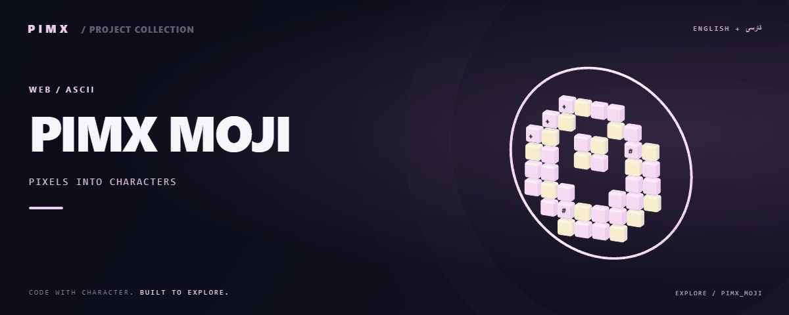

<div align="center">



**[English](README.md) · [فارسی](README.fa.md)**


</div>

# PIMX MOJI

استودیوی تبدیل تصویر به هنر متنی در مرورگر؛ دارای سبک‌های آماده، انتخاب کاراکتر، پردازش Canvas، پیش‌نمایش و تاریخچه تبدیل.

[GitHub](https://github.com/MOHAMMADREZAABEDINPOOR/PIMX_MOJI) · [PIMX / Profile](https://github.com/MOHAMMADREZAABEDINPOOR) · [بنر ثابت](assets/readme/hero.png)

## امکانات

- پردازش تصویر و مجموعه کاراکتر قابل تنظیم
- پیش‌نمایش سبک، بزرگ‌نمایی خروجی و تاریخچه
- تنظیم زبان و پوسته در کانتکست مشترک
- مسیر اختیاری آمار بازدید با Cloudflare D1

## پشته فنی

| ابزار | نسخه یا منبع |
|---|---|
| React | `^19.0.0` |
| Vite | `^6.2.0` |
| TypeScript | `~5.8.2` |
| Express | `^4.21.2` |
| Motion | `^12.23.24` |
| Tailwind CSS | `^4.1.14` |

## شروع کار

Node.js 22.12 یا بالاتر و مدیر پکیج مشخص‌شده در package.json. نسخه وابستگی‌ها را مطابق فایل قفل نصب کنید.

```bash
git clone https://github.com/MOHAMMADREZAABEDINPOOR/PIMX_MOJI.git
cd PIMX_MOJI

npm ci
npm run dev
```

## تنظیمات

کلیدهای زیر از فایل نمونه یا کد استخراج شده‌اند؛ همه الزاماً اجباری نیستند. مقدار و پیش‌فرض را در همان فایل بررسی و اسرار را فقط در محیط محلی یا هاست تنظیم کنید.

| نام | کاربرد |
|---|---|
| `APP_URL` | تنظیم برنامه؛ تعریف را در منبع بررسی کنید |
| `GEMINI_API_KEY` | اعتبارنامه یا اتصال؛ خصوصی نگه دارید |

اتصال‌های میزبانی: `DB`.

## استفاده

تصویر را وارد کنید، سبک یا مجموعه کاراکتر را انتخاب کنید، تنظیمات را تغییر دهید و خروجی بگیرید. برای شروع تصویر کوچک با کنتراست زیاد مناسب است.

## ساختار پروژه

| مسیر | نقش |
|---|---|
| [`assets/`](assets/) | فایل برند، رسانه و README |
| [`functions/`](functions/) | توابع API میزبانی |
| [`public/`](public/) | فایل عمومی وب |
| [`src/`](src/) | کد برنامه |
| [`index.html`](index.html) | فایل ورودی یا تنظیم پروژه |
| [`metadata.json`](metadata.json) | فایل ورودی یا تنظیم پروژه |
| [`package.json`](package.json) | فایل ورودی یا تنظیم پروژه |
| [`tsconfig.json`](tsconfig.json) | فایل ورودی یا تنظیم پروژه |
| [`wrangler.toml`](wrangler.toml) | فایل ورودی یا تنظیم پروژه |

## فرمان‌ها و بررسی

```bash
npm run dev
npm run build
npm run preview
npm run lint
```

این‌ها فرمان‌های موجود در package.json هستند؛ فهرست بالا گزارش اجرای آزمون نیست. فرمان تست ممکن است مرورگر، سرویس یا دیتابیس آماده بخواهد.

## استقرار

خروجی build را مطابق معماری منتشر کنید: پروژه دارای server به فرایند Node نیاز دارد؛ رابط Vite استاتیک می‌تواند از dist میزبانی شود. توابع Pages، KV یا D1 به تنظیم مستقل نیاز دارند.

## محدودیت‌ها

تصاویر بزرگ حافظه زیادی در مرورگر مصرف می‌کنند. بخش آمار به اتصال و ساختار D1 مستقل نیاز دارد؛ ویرایشگر هنر بدون این بخش اجرا می‌شود.

## رفع مشکل

- پکیج غایب: وابستگی را با مدیر پکیج پروژه نصب کنید.
- خطای API یا شبکه: آدرس، سرویس و اتصال میزبانی را بررسی کنید.
- فایل قدیمی: در صورت وجود اسکریپت ساخت، build و کش مرورگر را تازه کنید.

## مشارکت

برای تغییر، شاخه مستقل بسازید، رفتار فعلی را بررسی کنید و توضیح روشن همراه تغییر بفرستید. اطلاعات خصوصی، خروجی build و دیتابیس محلی را commit نکنید.

## مجوز

فایل مجوز در این نسخه موجود نیست. نمایش عمومی کد به‌تنهایی مجوز استفاده مجدد نیست؛ برای شرایط استفاده با مالک مخزن هماهنگ کنید.

---

ساخته‌شده در مجموعه **PIMX** · مستندات فارسی و انگلیسی.
